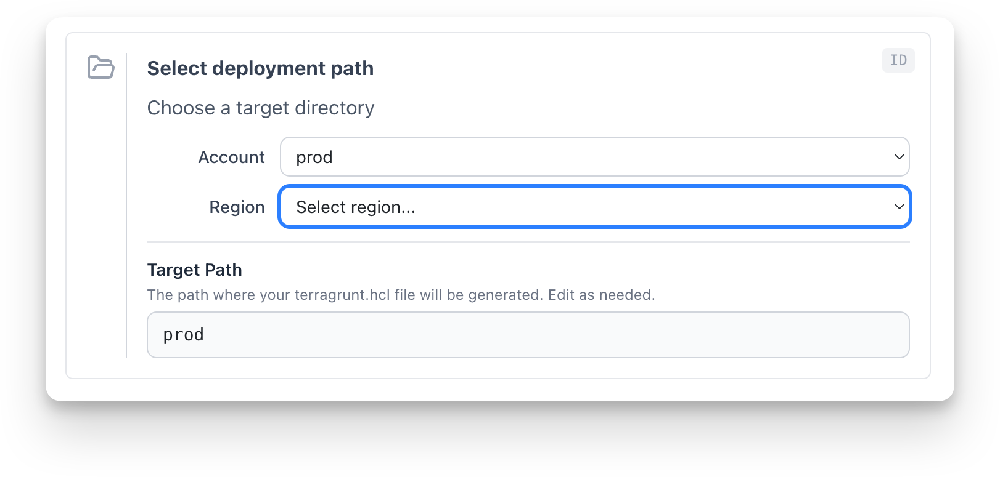

The `<DirPicker>` block provides a cascading set of dropdowns for selecting a path. 

For example, if the user git cloned a repository with the following directory structure:

```
.
├── dev
│   ├── region-1
│   └── region-2
└── prod
    ├── region-1
    ├── region-2
    └── region-3
```

The DirPicker block could be configured with the following props:

```mdx
<DirPicker
  id="target-path"
  rootDir="/path/to/repo"
  dirLabels={['Account', 'Region']}
/>
```

Users then get a form with one dropdown for each directory level.



The options available in the dropdowns are the immediate subdirectories of the current directory. For example, if the user selects "dev" in the first dropdown, the options in the second dropdown will be "region-1" and "region-2".

Users can also type a path directly into an auto-populated and editable text input below the dropdowns (called "Target Path" in the above screenshot).

The selected path is registered as a block output, making it available to downstream `<TemplateInline>` blocks via the `{{ ._blocks.<id>.outputs.PATH }}` syntax.
  
### Basic Usage

DirPicker needs a root directory to browse. You can provide one in two ways:

**Option 1: `rootDir`** — pass an explicit directory path:

```mdx
<DirPicker
  id="target-path"
  rootDir="/path/to/repo"
  dirLabels={['Account', 'Region', 'Category']}
  title="Select deployment path"
  description="Choose where to place the generated configuration"
/>
```

**Option 2: `gitCloneId`** — reference a `<GitClone>` block. DirPicker waits for the clone to complete, then uses the cloned repository as its root directory:

```mdx
<GitClone id="clone-repo" title="Clone Repository" />

<DirPicker
  id="target-path"
  gitCloneId="clone-repo"
  dirLabels={['Account', 'Region', 'Category']}
  title="Select deployment path"
  description="Choose where to place the generated configuration"
/>
```

At least one of `rootDir` or `gitCloneId` must be provided. If both are set, `rootDir` takes precedence.

### Use cases

We built the DirPicker block specifically for the developer self-service use case.

For example, suppose a developer who doesn't know infrastructure-as-code very well wants to deploy a new application to a specific AWS account. They could use the DirPicker block to get a guided UI that helps them select the account, region, and application name, and then the block generates exactly the right path.

More generally, the DirPicker block can be used to help users select any path when the meaning of the levels of a directory hierarchy is known in advance.

### Props

| Prop | Type | Required | Description |
|------|------|----------|-------------|
| `id` | `string` | Yes | Unique block identifier. Used by downstream blocks to reference outputs. |
| `rootDir` | `string` | No* | Absolute path to the root directory to browse. When set, the block uses this path directly. |
| `gitCloneId` | `string` | No* | ID of a `<GitClone>` block. DirPicker waits for the clone to complete, then uses the cloned repository as its root directory. |
| `title` | `string` | No | Display title. Supports inline markdown. Defaults to "Select Directory". |
| `description` | `string` | No | Description text below the title. Supports inline markdown. Defaults to "Choose a target directory". |
| `dirLabels` | `string[]` | Yes | Ordered labels for each directory level (e.g., `['Account', 'Region']`). Also caps the number of dropdowns to `dirLabels.length` unless `dirLabelsExtra` is true. |
| `dirLabelsExtra` | `boolean` | No | When `true`, allow navigating deeper than `dirLabels.length`. Extra levels are labelled "Level N". Defaults to `false`. |
| `pathLabel` | `string` | No | Label for the editable path text input. Defaults to "Target Path". |
| `pathLabelDescription` | `string` | No | Description text shown below the path label. Supports inline markdown. |

\* At least one of `rootDir` or `gitCloneId` is required. If both are set, `rootDir` takes precedence.

### Outputs

| Output | Description |
|--------|-------------|
| `PATH` | The composed directory path (relative to the workspace root). Updated on every dropdown selection or manual edit. |

### Directory-Level Labels

The required `dirLabels` prop assigns meaningful names to each cascading directory level. Each entry in the array labels the corresponding depth of the directory tree. Each dropdown shows a labelled header (e.g. "Account") and its placeholder reads "Select account...".

If the user drills deeper than the number of labels provided and the block is configured with `dirLabelsExtra={true}`, extra levels fall back to "Level N".

### Using Outputs in Templates

The DirPicker outputs `PATH`, which can be referenced in a `<TemplateInline>` block's `outputPath` prop:

```mdx
<TemplateInline
  inputsId="module-vars"
  outputPath="{{ ._blocks.target_path.outputs.PATH }}/terragrunt.hcl"
  generateFile={true}
  target="worktree"
>
```

The `outputPath` resolves `{{ ._blocks.*.outputs.* }}` expressions client-side using block outputs, so the file is written to the directory the user selected.

### How It Works

1. DirPicker resolves its root directory from `rootDir` (if set) or by reading the `CLONE_PATH` output of the referenced `<GitClone>` block once the clone completes.
2. It fetches the immediate subdirectories via `GET /api/workspace/dirs`.
3. Each dropdown selection triggers a fetch for the next level's subdirectories, building a cascading drill-down.
4. An editable text input below the dropdowns shows the composed path. Users can edit this directly for full control.
5. On every change (dropdown or manual edit), the block registers `PATH` as an output.

Hidden directories (those starting with `.`) are excluded from the dropdown options.
