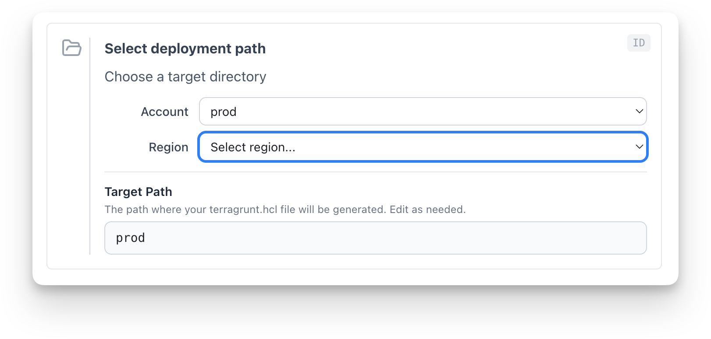

import { FileTree } from '@astrojs/starlight/components';

The `<DirPicker>` block renders a cascading set of dropdowns for selecting a directory path.

For example, if the user cloned a repository with this directory structure:

<FileTree>

- dev/
  - region-1/
  - region-2/
- prod/
  - region-1/
  - region-2/
  - region-3/

</FileTree>

The DirPicker block could be configured with these props:

```mdx
<DirPicker
  id="target-path"
  rootDir="/path/to/repo"
  dirLabels={['Account', 'Region']}
/>
```

Users then get a form with one dropdown for each directory level.



The options in each dropdown are the immediate subdirectories of the directory selected above it. If the user selects "dev" in the first dropdown, the second offers "region-1" and "region-2".

Users can also type a path directly into the editable text input below the dropdowns, labelled "Target Path" in the screenshot above.

The selected path is registered as a block output, available to later `<TemplateInline>` blocks as `{{ .outputs.<id>.PATH }}`.

### Basic usage

DirPicker needs a root directory to browse. You can provide one in two ways.

With `rootDir`, pass an explicit directory path:

```mdx
<DirPicker
  id="target-path"
  rootDir="/path/to/repo"
  dirLabels={['Account', 'Region', 'Category']}
  title="Select deployment path"
  description="Choose where to place the generated configuration"
/>
```

With `gitCloneId`, reference a `<GitClone>` block. DirPicker waits for the clone to complete, then uses the cloned repository as its root directory:

```mdx
<GitClone id="clone-repo" title="Clone Repository" />

<DirPicker
  id="target-path"
  gitCloneId="clone-repo"
  dirLabels={['Account', 'Region', 'Category']}
  title="Select deployment path"
  description="Choose where to place the generated configuration"
/>
```

At least one of `rootDir` or `gitCloneId` must be provided. If both are set, `rootDir` takes precedence.

### Use cases

We built the DirPicker block for developer self-service.

Suppose a developer who doesn't know infrastructure-as-code well wants to deploy a new application to a specific AWS account. The DirPicker block gives them a guided UI for picking the account, region, and application name, and produces the right path.

More generally, the block helps users select any path when the meaning of each directory level is known in advance.

### Props

| Prop | Type | Required | Description |
|------|------|----------|-------------|
| `id` | `string` | Yes | Unique block identifier. Later blocks use it to reference outputs. |
| `rootDir` | `string` | No* | Absolute path to the root directory to browse. When set, the block uses this path directly. |
| `gitCloneId` | `string` | No* | ID of a `<GitClone>` block. DirPicker waits for the clone to complete, then uses the cloned repository as its root directory. |
| `inputsId` | `string \| string[]` | No | ID of one or more `<Inputs>` blocks, for `{{ .inputs.* }}` expressions in props. |
| `title` | `string` | No | Display title. Supports inline markdown. Defaults to "Select Directory". |
| `description` | `string` | No | Description text below the title. Supports inline markdown. Defaults to "Choose a target directory". |
| `dirLabels` | `string[]` | No | Ordered labels for each directory level (for example `['Account', 'Region']`). Also caps the number of dropdowns at `dirLabels.length` unless `dirLabelsExtra` is true. When omitted, depth is unbounded and every level is labelled "Level N". |
| `dirLabelsExtra` | `boolean` | No | When `true`, allow navigating deeper than `dirLabels.length`. Extra levels are labelled "Level N". Defaults to `false`. |
| `pathLabel` | `string` | No | Label for the editable path text input. Defaults to "Target Path". |
| `pathLabelDescription` | `string` | No | Description text shown below the path label. Supports inline markdown. |

\* At least one of `rootDir` or `gitCloneId` is required. If both are set, `rootDir` takes precedence.

### Outputs

| Output | Description |
|--------|-------------|
| `PATH` | The selected path, relative to the root directory, with the dropdown selections joined by `/`. Updated on every dropdown selection or manual edit. When the path is empty (the first dropdown is reset to its placeholder or the text input is cleared), `PATH` is removed, so blocks that reference it wait until a path is chosen again. The same happens when the `<GitClone>` block's clone path changes: the dropdowns and the path start over from the new root. |

### Directory-level labels

`dirLabels` names each cascading directory level. Each entry labels the corresponding depth of the tree: the dropdown shows a header such as "Account" and its placeholder reads "Select account...".

Without `dirLabels`, every dropdown is labelled "Level N" and the user can drill as deep as the tree goes. With `dirLabels`, the number of dropdowns is capped at the number of labels unless `dirLabelsExtra={true}`, in which case deeper levels are labelled "Level N".

### Using outputs in templates

The DirPicker outputs `PATH`, which can be referenced in a `<TemplateInline>` block's `outputPath` prop:

```mdx
<TemplateInline
  id="module-config"
  inputsId="module-vars"
  outputPath="{{ .outputs.target_path.PATH }}/terragrunt.hcl"
  generateFile={true}
  target="worktree"
>
```

The `outputPath` resolves `{{ .outputs.*.* }}` expressions client-side using block outputs, so the file is written to the directory the user selected. When the user picks or types a different directory, the block cleans up the file it wrote for the earlier selection. If the block created that file, it is removed. If the earlier directory already had a `terragrunt.hcl`, for example because it is an existing unit, that file is put back the way it was. A file edited since the block wrote it is left as it is.

### How it works

1. DirPicker resolves its root directory from `rootDir` (if set) or by reading the `clone_path` output of the referenced `<GitClone>` block once the clone completes.
2. It lists the immediate subdirectories of the root directory to fill the first dropdown.
3. Each dropdown selection triggers a fetch for the next level's subdirectories, building a cascading drill-down.
4. An editable text input below the dropdowns shows the composed path. Users can edit it directly.
5. On every change (dropdown or manual edit), the block registers `PATH` as an output. Clearing the path removes the output.

Hidden directories (those starting with `.`) are excluded from the dropdown options.
