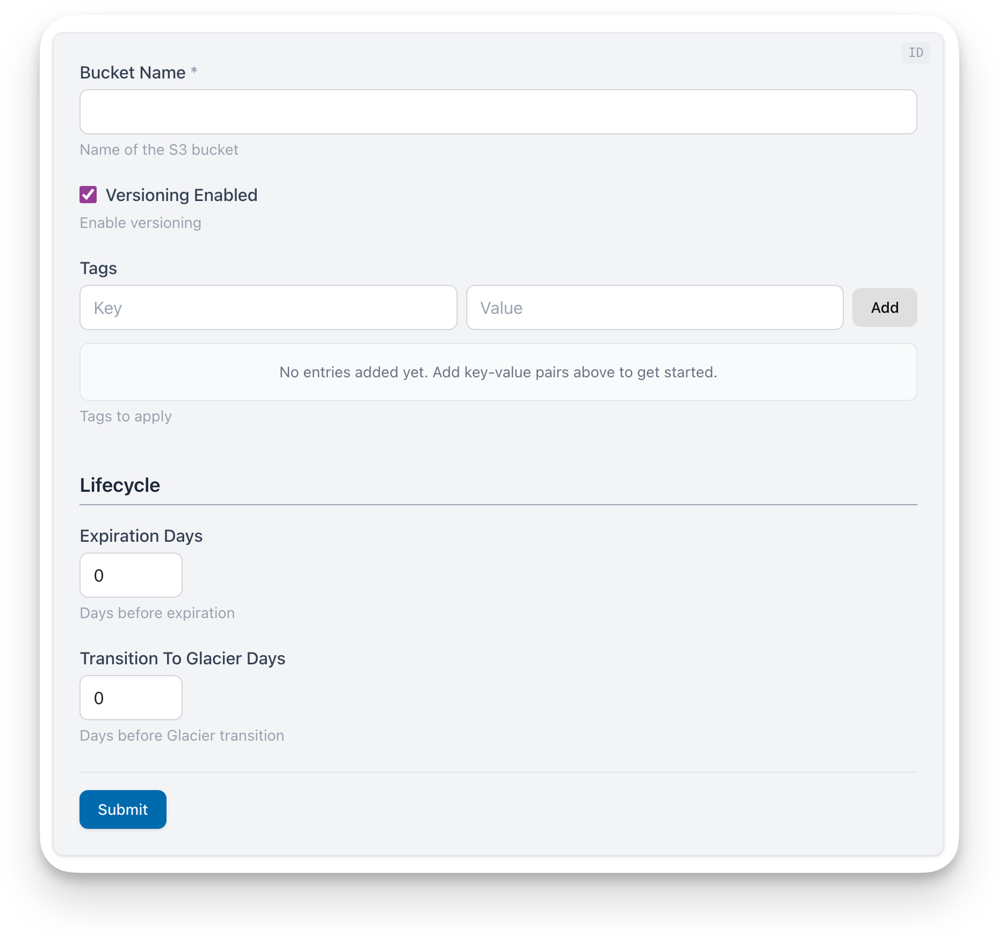

import { Aside } from '@astrojs/starlight/components';

The `<TfModule>` block parses an OpenTofu/Terraform module, dynamically renders a web form to collect values for all the module's variables, and publishes the collected values as outputs that can be referenced by other blocks.

In other words, it turns this OpenTofu/Terraform file:

```hcl title="variables.tf"
variable "bucket_name" {
  type        = string
  description = "Name of the S3 bucket"
  validation {
    condition     = can(regex("^[a-z0-9][a-z0-9.-]*[a-z0-9]$", var.bucket_name))
    error_message = "Must be lowercase alphanumeric with dots and hyphens."
  }
}

variable "versioning_enabled" {
  type        = bool
  default     = true
  description = "Enable versioning"
}

variable "tags" {
  type        = map(string)
  default     = {}
  description = "Tags to apply"
}

# @runbooks:group "Lifecycle"
variable "expiration_days" {
  type        = number
  default     = 0
  description = "Days before expiration"
}

# @runbooks:group "Lifecycle"
variable "transition_to_glacier_days" {
  type        = number
  default     = 0
  description = "Days before Glacier transition"
}
```

Into this runbook:



Note that the OpenTofu/Terraform author can annotate some variables with `# @runbooks:group "Group Name"` comments to group them together under a common heading.

### Why use TfModule?

The TfModule makes it possible to dynamically render a runbook based on an OpenTofu/Terraform module. For example:

```bash
runbooks open https://github.com/gruntwork-io/runbooks/tree/main/testdata/test-fixtures/tf-modules/s3-bucket
```

This means that every OpenTofu/Terraform module you've already defined can be used to generate a runbook that will collect values for the module's variables and then generate any file output format, such as a Terragrunt HCL file, Helm chart YAML file, CloudFormation template, or anything else.

The TfModule is a critical building block for this use case. To learn more about opening runbooks based on OpenTofu/Terraform modules, see the [Opening Runbooks](/authoring/opening-runbooks/) docs.

## Basic Usage

The most common pattern is a **generic runbook** that accepts any module URL from the CLI using `::cli_runbook_source`:

`````mdx
<TfModule id="module-vars" source="::cli_runbook_source" />

<Template id="output" inputsId="module-vars" path="templates/terragrunt" />
`````

The `::cli_runbook_source` keyword resolves to whatever module URL was passed to `runbooks open`. This lets a single runbook work with any OpenTofu/Terraform module. See [Opening Runbooks](/authoring/opening-runbooks/) for the full guide on custom templates and built-in templates.

You can also reference a **specific module** by path or URL:

`````mdx
<TfModule id="rds-vars" source="../modules/rds" />

<Template id="rds-output" inputsId="rds-vars" path="templates/rds" />
`````

This is useful when you're writing a runbook for a known module. The `<TfModule>` block parses the `.tf` files at `../modules/rds` and renders a web form. The `<Template>` block imports the values via `inputsId` and generates files from the template at `templates/rds`.

<Aside type="tip">
For quick prototyping you can also use [`<TemplateInline>`](/authoring/blocks/templateinline/) to embed template text directly in the runbook. See [Using TemplateInline](#using-templateinline) below.
</Aside>

## vs. Inputs

Both `<TfModule>` and `<Inputs>` collect user values and publish them to context, but they serve different purposes.

- **`<TfModule>`** parses `.tf` files (OpenTofu/Terraform modules) at runtime and auto-generates an input form from the module's variables. It provides a `_module` namespace with source, metadata, `inputs`, and `hcl_inputs`, enabling dynamic iteration over all variables without knowing their names upfront. Use it when you want to generate files from an existing OpenTofu/Terraform module.
- **`<Inputs>`** defines variables explicitly in inline YAML or a `boilerplate.yml`. Each variable must be referenced by name in templates. Use it when you want to collect arbitrary user input that doesn't come from a `.tf` module.

## Props

### Required Props

- `id` (string) - Unique identifier for this component. Other blocks reference this ID via `inputsId` to access the collected values.
- `source` (string) - Path or URL to the OpenTofu/Terraform module directory containing `.tf` files. See [Supported Source Formats](#supported-source-formats) below.

## Supported Source Formats

The `source` prop accepts the same formats as the `runbooks open` CLI command:

| Format | Example |
|--------|---------|
| Local relative path | `../modules/rds` |
| Colocated (same directory) | `.` |
| Dynamic from CLI | `::cli_runbook_source` |
| GitHub shorthand | `github.com/org/repo//modules/rds?ref=v1.0.0` |
| Git prefix | `git::https://github.com/org/repo.git//modules/rds?ref=v1.0.0` |
| GitHub browser URL | `https://github.com/org/repo/tree/main/modules/rds` |
| GitLab browser URL | `https://gitlab.com/org/repo/-/tree/main/modules/rds` |

<Aside type="tip">
For remote sources, use `?ref=v1.0.0` (or a branch/commit) to pin to a specific version. Without a ref, the default branch is used.
</Aside>

### Colocated Runbooks (`source="."`)

When a module author places a `runbook.mdx` alongside their `.tf` files, they can use `source="."` to reference the module in the same directory. When someone runs `runbooks open` pointing at that directory (locally or via a remote URL), the CLI detects the colocated `runbook.mdx` and serves it instead of auto-generating a generic one.

This lets module authors ship a custom, polished runbook experience alongside their module code:

```
modules/rds/
├── main.tf
├── variables.tf
├── outputs.tf
└── runbook.mdx        ← custom runbook
```

Inside `runbook.mdx`:

`````mdx
# Configure RDS

<TfModule id="rds-vars" source="." />

<TemplateInline inputsId="rds-vars" outputPath="terragrunt.hcl" generateFile={true}>
```hcl
terraform {
  source = "{{ ._module.source }}"
}

inputs = {
{{- range $name, $hcl := ._module.hcl_inputs }}
  {{ $name }} = {{ $hcl }}
{{- end }}
}
```
</TemplateInline>
`````

Anyone can then run this module's custom runbook:

```bash
runbooks open https://github.com/my-org/infra-modules/tree/main/modules/rds
```

### Dynamic Source from CLI

The `::cli_runbook_source` keyword resolves to whatever module URL was passed to the `runbooks open` command (or `runbooks watch` / `runbooks serve`). This enables a **generic runbook** that works with any OpenTofu/Terraform module without hardcoding a specific module path.

`````mdx
<TfModule id="module-vars" source="::cli_runbook_source" />
`````

If the runbook is opened without a module URL, `<TfModule>` renders a message explaining how to provide one.

<Aside type="tip">
For details on built-in templates (`::terragrunt`, `::tofu`, `::terragrunt-github`), custom templates, and the `--tf-runbook` flag, see [Opening Runbooks](/authoring/opening-runbooks/).
</Aside>

## The `_module` Namespace

When `<TfModule>` registers its values, it outputs a `_module` value that is a map of key-value pairs. This enables both iteration over all variables and direct access to specific ones.

You can access the `_module` value in your templates just like any other value, using the `{{ ._module }}` syntax.

### Structure

```
_module:
  source: "github.com/org/repo//modules/rds?ref=v1.0.0"
  folder_name: "rds"
  readme_title: "RDS Module"
  output_names: ["db_endpoint", "db_name", "db_port"]
  resource_names: ["aws_db_instance.this", "aws_db_parameter_group.this", "aws_db_subnet_group.this"]
  inputs:
    instance_class: "db.t3.micro"
    engine_version: "16.3"
    allocated_storage: 20
    multi_az: true
  hcl_inputs:
    instance_class: "\"db.t3.micro\""
    engine_version: "\"16.3\""
    allocated_storage: "20"
    multi_az: "true"
  hcl_inputs_non_default:
    instance_class: "\"db.t3.micro\""
    allocated_storage: "20"
    multi_az: "true"
```

- **`source`:** The module source from the `source` prop. Useful for embedding in generated config.
- **`folder_name`:** Name of the module's containing directory (e.g., `"rds"`).
- **`readme_title`:** The first `# Heading` from the module's README.md, if present. Empty string otherwise.
- **`output_names`:** List of output block names defined in the module (sorted alphabetically).
- **`resource_names`:** List of resource block names as `type.name` (sorted, excludes `data` sources).
- **`inputs`:** Map of all variable names to their raw values as entered by the user. Use when generating non-HCL formats (YAML, JSON, TOML) where you control the formatting.
- **`hcl_inputs`:** Map of all variable names to HCL-formatted string values: strings are quoted, booleans and numbers are raw, lists and maps are JSON-encoded. Use when generating HCL files (Terragrunt, Terraform). Values are pre-formatted with correct HCL quoting.
- **`hcl_inputs_non_default`:** Same as `hcl_inputs`, but only includes variables whose current value differs from the module's declared default. Required variables (no default) are always included.

## Block Outputs

In addition to the `_module` namespace (which is available via `inputsId`), `<TfModule>` also registers block outputs that can be referenced by downstream blocks using the `{{ ._blocks.<id>.outputs.<key> }}` syntax.

| Output | Description |
|--------|-------------|
| `module_name` | The module's folder name (same as `_module.folder_name`). Useful in `outputPath` expressions for naming generated directories. |
| `source` | The resolved module source URL. |

For example, the `::terragrunt-github` template uses `module_name` to compose the output path:

```
outputPath="{{ ._blocks.target_path.outputs.path }}/{{ ._blocks.module_vars.outputs.module_name }}/terragrunt.hcl"
```

## Variable Grouping

When `<TfModule>` renders the input form, it automatically "groups" variables into collapsible sections. Grouping is purely a UI feature that organizes a set of variables together under a common heading to help reduce cognitive load on the end user. This is especially useful when a module has many variables and would otherwise render as an endless of form fields. Grouping has no effect on the generated output or template behavior.

So how does Runbooks know which variables to group together? The grouping strategy follows a priority order:

1. **`@runbooks:group` comments:** explicit groups defined in the `.tf` source
2. **Filename-based:** variables grouped by which `.tf` file they're defined in
3. **Prefix-based:** variables grouped by shared name prefixes (e.g., `db_*`, `vpc_*`)
4. **Required vs. Optional:** fallback grouping

### `@runbooks:group` Comments

Module authors can explicitly control grouping by adding `# @runbooks:group "Group Name"` comments directly above variable blocks in their `.tf` files:

```hcl
variable "bucket_name" {
  type        = string
  description = "Name of the S3 bucket"
}

# @runbooks:group "Lifecycle"
variable "expiration_days" {
  type        = number
  default     = 0
  description = "Days before expiration"
}

# @runbooks:group "Lifecycle"
variable "transition_to_glacier_days" {
  type        = number
  default     = 0
  description = "Days before Glacier transition"
}
```

In this example, the two lifecycle variables are grouped together under a "Lifecycle" section. The `bucket_name` variable (with no annotation) appears in an unnamed default section.

<Aside type="tip">
The `@runbooks:group` annotation is the recommended way to control variable grouping. It's explicit, portable (lives in the module source), and takes priority over all automatic grouping strategies.
</Aside>

## Template Patterns

### Using `<TemplateInline>`

[`<TemplateInline>`](/authoring/blocks/templateinline/) embeds the template directly in the runbook. It's a good choice for generating a single file because everything is visible and editable in one place with no external files needed.

#### For Terragrunt HCL

One common pattern is generating a `terragrunt.hcl` that "instantiates" an OpenTofu/Terraform module. Here, we iterate over all module variables using `_module.hcl_inputs`:

`````mdx
<TfModule id="module-vars" source="../modules/rds" />

<TemplateInline inputsId="module-vars" outputPath="terragrunt.hcl" generateFile={true}>
```hcl
terraform {
  source = "{{ ._module.source }}"
}

include "root" {
  path   = find_in_parent_folders("root.hcl")
  expose = true
}

inputs = {
{{- range $name, $hcl := ._module.hcl_inputs }}
  {{ $name }} = {{ $hcl }}
{{- end }}
}
```
</TemplateInline>
`````

<Aside type="note">
The `hcl_inputs` map handles type-aware formatting automatically: strings are quoted (`"value"`), booleans are raw (`true`/`false`), numbers are raw (`42`), and lists/maps are JSON-encoded.
</Aside>

#### Non-Default Inputs

The example above will render every module variable, even those left empty or matching the declared default. This could be quite verbose in some cases. Use `_module.hcl_inputs_non_default` instead to generate a minimal `inputs` block that excludes any variable whose value matches the default defined in the module's `.tf` file:

`````mdx
<TfModule id="module-vars" source="../modules/rds" />

<TemplateInline inputsId="module-vars" outputPath="terragrunt.hcl" generateFile={true}>
```hcl
terraform {
  source = "{{ ._module.source }}"
}

include "root" {
  path   = find_in_parent_folders("root.hcl")
  expose = true
}

inputs = {
{{- range $name, $hcl := ._module.hcl_inputs_non_default }}
  {{ $name }} = {{ $hcl }}
{{- end }}
}
```
</TemplateInline>
`````

#### Referencing Individual Variables

You can also reference specific variables by name instead of iterating:

`````mdx
<TfModule id="module-vars" source="../modules/rds" />

<TemplateInline inputsId="module-vars" outputPath="summary.txt">
```
Instance Class: {{ .instance_class }}
Engine Version: {{ .engine_version }}
Module Source: {{ ._module.source }}
```
</TemplateInline>
`````

### Using `<Template>`

[`<Template>`](/authoring/blocks/template/) points to a separate directory containing a `boilerplate.yml` and one or more template files. Use it when you need multi-file scaffolding or extra variables beyond what the module defines.

#### Multiple Output Files

A single `<Template>` block can produce multiple files. To do this, add more template files to the template directory:

`````mdx
<TfModule id="module-vars" source="../modules/rds" />

<Template id="rds-scaffold" path="templates/rds-scaffold" inputsId="module-vars" />
`````

Inside `templates/rds-scaffold/terragrunt.hcl`:

```hcl
terraform {
  source = "{{ ._module.source }}"
}

inputs = {
{{- range $name, $hcl := ._module.hcl_inputs }}
  {{ $name }} = {{ $hcl }}
{{- end }}
}
```

Inside `templates/rds-scaffold/README.md`:

```markdown
# {{ ._module.readme_title }}

Source: `{{ ._module.source }}`

## Outputs

{{- range ._module.output_names }}
- `{{ . }}`
{{- end }}
```

#### Extra Variables with Template

Because `<Template>` is backed by a `boilerplate.yml`, it renders **its own input form** in addition to the form that `<TfModule>` renders. Any variables defined in `boilerplate.yml` that are *not* provided by TfModule appear as extra editable fields, giving you a way to collect additional user input (e.g., environment name, team owner) that the `.tf` files know nothing about.

<Aside type="note">
Since both TfModule and Template can define variables, Runbooks merges the two sets. Template-only variables stay editable, TfModule-only variables (including `_module.*`) pass through invisibly, and overlapping variables become read-only. See [Inputs & Outputs — When Variables Overlap](/authoring/inputs-and-outputs/#when-variables-overlap) for the full explanation.
</Aside>