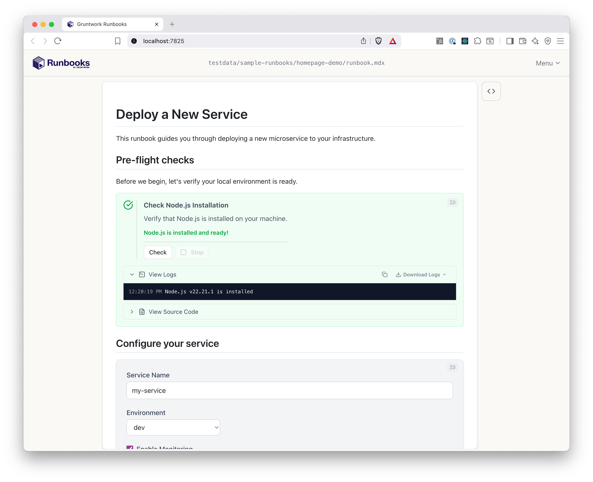
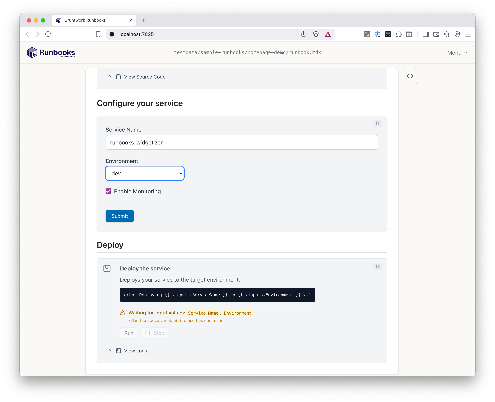

import { Card, CardGrid, Icon, Steps, Tabs, TabItem } from '@astrojs/starlight/components';
import SourceFile from '../../components/SourceFile.astro';

## How it works

<Steps>

1. **Authors write MDX**

   You write a runbook in MDX (markdown with interactive blocks) in your editor, just like code.

   Here's a real runbook:

   <SourceFile file="testdata/sample-runbooks/homepage-demo/runbook.mdx" lang="mdx" hideTitle />

   <a href="https://github.com/gruntwork-io/runbooks/tree/main/testdata/sample-runbooks/homepage-demo" target="_blank" rel="noopener noreferrer" class="source-link">View this runbook on GitHub →</a>

2. **Developers get a guided UI**

   That MDX renders into a clean web interface. Developers fill out forms, run checks, and execute commands. No copy-pasting, no guesswork.

</Steps>

<Tabs>
  <TabItem label="Pre-flight checks">
    
  </TabItem>
  <TabItem label="Configure service">
    
  </TabItem>
  <TabItem label="Deploy">
    
  </TabItem>
</Tabs>

## Choose the blocks you need

Gruntwork Runbooks ships with a growing set of blocks that handle common infrastructure tasks. Mix and match them to build your workflow.

  <a class="block-row" href="/authoring/blocks/command/">
    <Icon name="rocket" size="1.25rem" />
    <strong>&lt;Command&gt;</strong>
    Execute shell commands and scripts with variable substitution and streaming output.
    →
  </a>
  <a class="block-row" href="/authoring/blocks/template/">
    <Icon name="add-document" size="1.25rem" />
    <strong>&lt;Template&gt;</strong>
    Generate files from Boilerplate templates. Render forms for variables, then write to the workspace.
    →
  </a>
  <a class="block-row" href="/authoring/blocks/awsauth/">
    <Icon name="setting" size="1.25rem" />
    <strong>&lt;AwsAuth&gt;</strong>
    Authenticate to AWS via SSO, static credentials, or local profiles. Credentials flow to subsequent blocks.
    →
  </a>
  <a class="block-row" href="/authoring/blocks/githubauth/">
    <Icon name="github" size="1.25rem" />
    <strong>&lt;GitHubAuth&gt;</strong>
    Authenticate to GitHub via OAuth, PAT, or the GitHub CLI. Detected credentials are confirmed before use.
    →
  </a>
  <a class="block-row" href="/authoring/blocks/githubpullrequest/">
    <Icon name="github" size="1.25rem" />
    <strong>&lt;GitHubPullRequest&gt;</strong>
    Open a pull request from changes made during the runbook. Completes the clone → modify → PR workflow.
    →
  </a>

[View all blocks →](/authoring/blocks/)

## Author in minutes, not weeks

No platform to deploy. No plugins to build. No YAML abstractions to learn.

Write a runbook in your editor using MDX, which is markdown you already know, with a handful of interactive blocks. It lives in git, gets reviewed in PRs, and stays close to the infrastructure it documents.

<CardGrid>
  <Card title="MDX Authoring" icon="pen">
    Markdown + interactive blocks. If you can write a README, you can write a runbook.
  </Card>
  <Card title="Lives in Git" icon="github">
    Runbooks are code. Version them, review them, share them like any other file in your repo.
  </Card>
  <Card title="Watch Mode" icon="approve-check">
    Edit your runbook and see changes instantly in the browser. Fast feedback loop for authors. [Learn more →](/commands/watch/)
  </Card>
</CardGrid>

## Generate files, open PRs, ship changes

Gruntwork Runbooks isn't just live documentation, it's a code generation pipeline.

Powered by [Gruntwork Boilerplate](/authoring/boilerplate/), the `<Template>` block renders files from templates with developer-supplied variables, previews the output in a built-in file tree, and writes results to the workspace.

Combine `<GitClone>` to clone a repo, `<Template>` to generate files, and `<GitHubPullRequest>` to open a PR, all in a single guided workflow.

<CardGrid>
  <Card title="Boilerplate Templates" icon="add-document">
    Generate files and folders from a template. Variables come from form inputs. [Learn more →](/authoring/blocks/template/)
  </Card>
  <Card title="Inline Templates" icon="document">
    Define small templates directly in your runbook MDX and give users inline previews. [Learn more →](/authoring/blocks/templateinline/)
  </Card>
  <Card title="Clone & PR" icon="github">
    Clone a repo with `<GitClone>`, make changes, and open a pull request with `<GitHubPullRequest>` for a complete end-to-end workflow. [Learn more →](/authoring/blocks/gitclone/)
  </Card>
  <Card title="File Preview" icon="open-book">
    Generated files render in a collapsible file tree with syntax-highlighted code. Developers see exactly what will be created before committing.
  </Card>
</CardGrid>

## Open source and self-contained

Gruntwork Runbooks is a single Go binary.

No servers to maintain, no cloud accounts to configure, no dependencies to manage. Everything executes locally on the developer's machine.

<CardGrid>
  <Card title="Single Binary" icon="laptop">
    One download. No runtime dependencies. Works offline. Runs on macOS and Linux.
  </Card>
  <Card title="Local Execution" icon="setting">
    All commands run on the developer's machine. No secrets leave the local environment.
  </Card>
  <Card title="Open Source" icon="heart">
    MPLv2 licensed. Full source on GitHub. No vendor lock-in, no surprise pricing.
  </Card>
</CardGrid>

## Get started

  <a href="/intro/installation/" class="compact-card">
    <strong>Install</strong>
    Install via Homebrew, download a binary, or build from source.
  </a>
  <a href="/intro/write_your_first_runbook/" class="compact-card">
    <strong>Write your first runbook</strong>
    Step-by-step tutorial to create and run your first runbook.
  </a>
  <a href="https://github.com/gruntwork-io/runbooks" class="compact-card">
    <strong>View on GitHub</strong>
    Browse the source, open issues, and contribute.
  </a>

