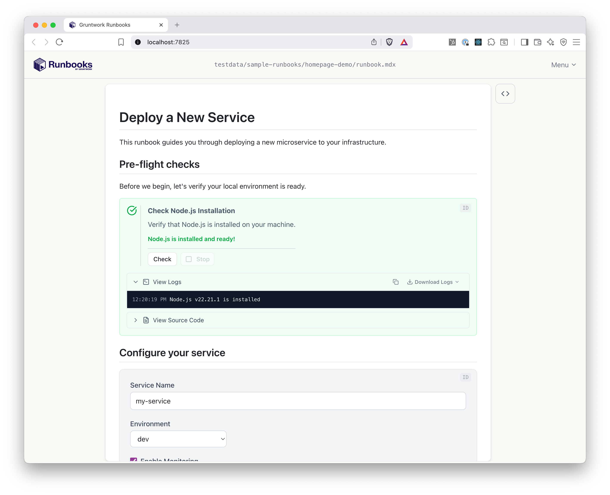
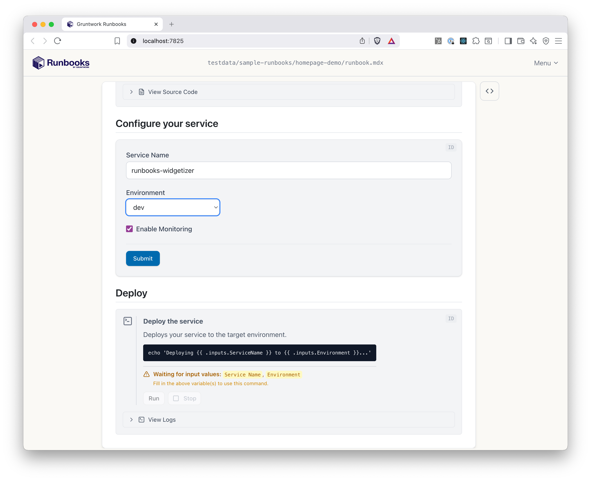

import { Card, CardGrid, Icon, Steps, Tabs, TabItem } from '@astrojs/starlight/components';
import SourceFile from '../../components/SourceFile.astro';

## How it works

<Steps>

1. **Authors write MDX**

   A runbook is an MDX file, which is markdown plus interactive blocks. This one is in the Runbooks repo:

   <SourceFile file="testdata/sample-runbooks/homepage-demo/runbook.mdx" lang="mdx" hideTitle />

   <a href="https://github.com/gruntwork-io/runbooks/tree/main/testdata/sample-runbooks/homepage-demo" target="_blank" rel="noopener noreferrer" class="source-link">View this runbook on GitHub →</a>

2. **Developers get a guided UI**

   The Runbooks desktop app renders that MDX. Developers fill out forms, run checks, and execute commands.

</Steps>

<Tabs>
  <TabItem label="Pre-flight checks">
    
  </TabItem>
  <TabItem label="Configure service">
    
  </TabItem>
  <TabItem label="Deploy">
    
  </TabItem>
</Tabs>

## Choose the blocks you need

A runbook combines blocks. These are five of them.

  <a class="block-row" href="/authoring/blocks/command/">
    <Icon name="rocket" size="1.25rem" />
    <strong>&lt;Command&gt;</strong>
    Execute shell commands and scripts with variable substitution and streaming output.
    →
  </a>
  <a class="block-row" href="/authoring/blocks/template/">
    <Icon name="add-document" size="1.25rem" />
    <strong>&lt;Template&gt;</strong>
    Generate files from Boilerplate templates. Render forms for variables, then write to the workspace.
    →
  </a>
  <a class="block-row" href="/authoring/blocks/awsauth/">
    <Icon name="setting" size="1.25rem" />
    <strong>&lt;AwsAuth&gt;</strong>
    Authenticate to AWS via SSO, static credentials, or local profiles. Later blocks run with those credentials.
    →
  </a>
  <a class="block-row" href="/authoring/blocks/githubauth/">
    <Icon name="github" size="1.25rem" />
    <strong>&lt;GitHubAuth&gt;</strong>
    Authenticate to GitHub via OAuth, PAT, or the GitHub CLI. Detected credentials are confirmed before use.
    →
  </a>
  <a class="block-row" href="/authoring/blocks/githubpullrequest/">
    <Icon name="github" size="1.25rem" />
    <strong>&lt;GitHubPullRequest&gt;</strong>
    Open a pull request from changes made during the runbook.
    →
  </a>

[View all blocks →](/authoring/blocks/)

## Author in your editor

A runbook is a `runbook.mdx` file. Keep it in git next to the infrastructure it documents and review it in pull requests.

<CardGrid>
  <Card title="MDX authoring" icon="pen">
    Markdown plus [blocks](/authoring/blocks/) such as `<Check>`, `<Command>` and `<Template>`.
  </Card>
  <Card title="Lives in git" icon="github">
    Open a runbook from a local folder or straight from a GitHub or GitLab URL.
  </Card>
  <Card title="Watch mode" icon="approve-check">
    `runbooks open --watch` reloads the runbook in the app each time you save it. [Learn more →](/commands/watch/)
  </Card>
</CardGrid>

## Generate files and open pull requests

The `<Template>` block renders files from a [Gruntwork Boilerplate](/authoring/boilerplate/) template using the values a developer enters, previews them in a file tree, and writes them to disk.

Combine `<GitClone>`, `<Template>` and `<GitHubPullRequest>` to clone a repo, generate files into it, and open a pull request.

<CardGrid>
  <Card title="Boilerplate templates" icon="add-document">
    Generate files and folders from a template. Variables come from form inputs. [Learn more →](/authoring/blocks/template/)
  </Card>
  <Card title="Inline templates" icon="document">
    Define small templates directly in your runbook MDX and give users inline previews. [Learn more →](/authoring/blocks/templateinline/)
  </Card>
  <Card title="Clone and PR" icon="github">
    Clone a repo with `<GitClone>`, make changes, and open a pull request with `<GitHubPullRequest>`. [Learn more →](/authoring/blocks/gitclone/)
  </Card>
  <Card title="File preview" icon="open-book">
    Generated files appear in a file tree with syntax highlighting, so developers can read them before committing.
  </Card>
</CardGrid>

## Open source desktop app

Gruntwork Runbooks is a desktop app for macOS, Linux and Windows. There is no server to deploy.

<CardGrid>
  <Card title="Desktop app" icon="laptop">
    Download an installer from the [GitHub releases page](https://github.com/gruntwork-io/runbooks/releases).
  </Card>
  <Card title="Local execution" icon="setting">
    Commands and scripts run on the developer's machine, with the developer's own credentials.
  </Card>
  <Card title="Open source" icon="heart">
    Licensed under MPL 2.0. The source is on [GitHub](https://github.com/gruntwork-io/runbooks).
  </Card>
</CardGrid>

## Get started

  <a href="/intro/installation/" class="compact-card">
    <strong>Install</strong>
    Download a release from GitHub, or build from source.
  </a>
  <a href="/intro/write_your_first_runbook/" class="compact-card">
    <strong>Write your first runbook</strong>
    Step-by-step tutorial to create and run your first runbook.
  </a>
  <a href="https://github.com/gruntwork-io/runbooks" class="compact-card">
    <strong>View on GitHub</strong>
    Browse the source, open issues, and contribute.
  </a>

