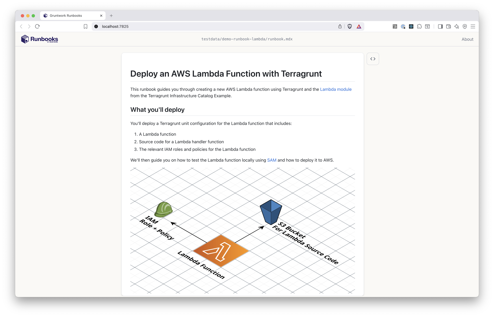
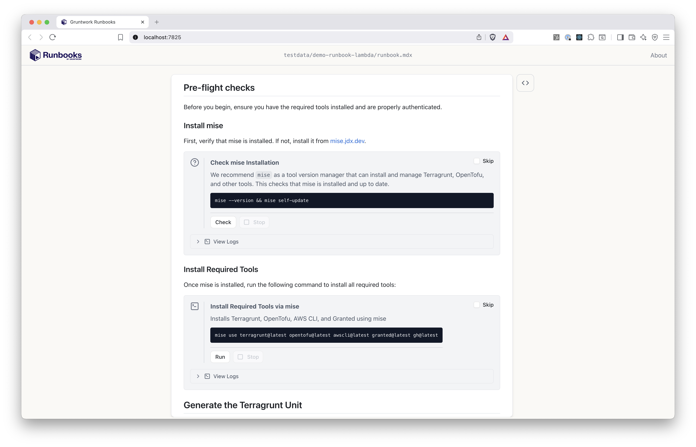
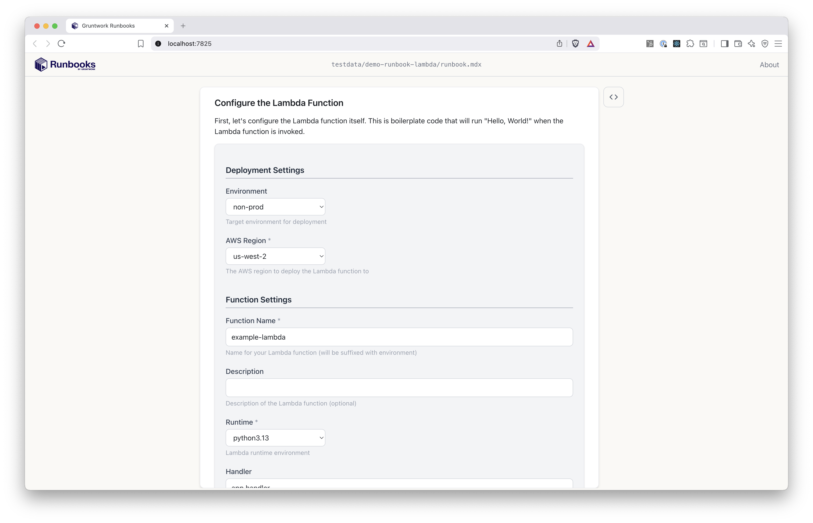
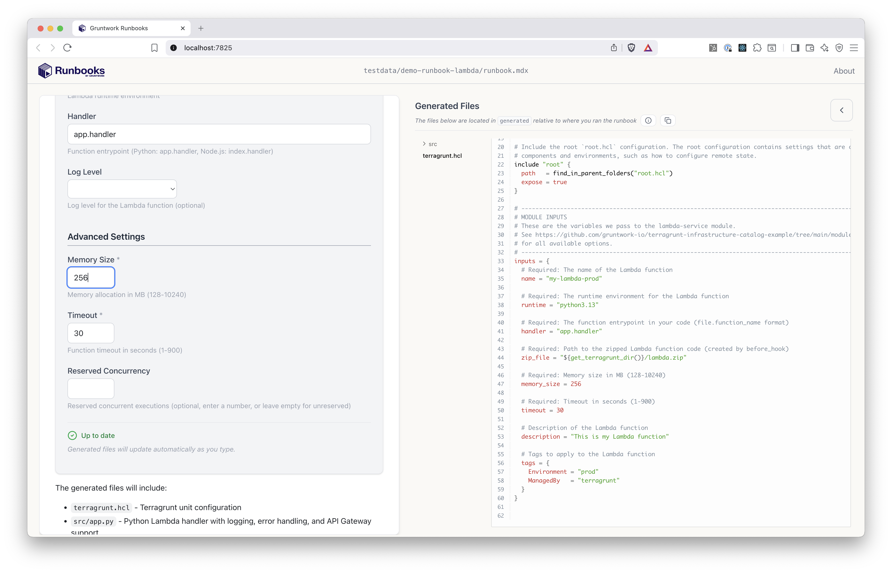

## Meet Gruntbooks!

Gruntwork Gruntbooks are interactive markdown documents that enable subject matter experts to capture their knowledge and expertise in a way that is easy for others to understand and use.

Gruntwork Gruntbooks is [open source](https://github.com/gruntwork-io/runbooks), built by [Gruntwork](https://gruntwork.io), and free to use.

### What can Gruntbooks do?

The Gruntbooks tool loads individual "gruntbook files" that:

- Render markdown text
- Collect user input from dynamically generated web forms
- Propagate user-entered values to:
  - Generate customized files and folders based on templates
  - Run customized scripts
  - Run customized "checks"

This collection of primitives -- inputs, code templates, scripts, and checks -- is a streamlined way to capture expertise and a highly efficient (and enjoyable) way for someone else to consume it.

### How is Gruntbooks useful?

DevOps and Platform Engineers are often the "expertise bottlenecks" when it comes to enabling their organization to achieve an infrastructure goal.

Historically, there has not been a straightforward way to "capture" this hard-won expertise and make it available to others. And yet platform engineers are often the bottleneck for application engineers or others who depend on them to accomplish infrastructure goals.

In any situation where a "consumer" of expertise is blocked on the "producer" of expertise, Gruntbooks is an opportunity to free up the expert and empower consumers. 

In practice, Gruntbooks is especially useful for:

- developer self-service
- setting up landing zones
- documenting internal processes or standard operating procedures
- codifying all the ways to use a given IaC pattern

Learn more by reading about [Gruntbooks use cases](/intro/use_cases).

### What does a gruntbook look like?

When a user runs `gruntbooks open /path/to/gruntbook` (or `gruntbooks open <remote-url>`), here's a sample of what they'll see:









For a full walkthrough of what's happening here, see the [UI tour](/intro/ui_tour).

### How is a gruntbook structured?

A typical Gruntbook directory looks like the file tree below. In this example, the file names are somewhat arbitrary, but the folder structure is conventional.

```
├── gruntbook.mdx
├── assets/
│    └── architecture.jpg
├── checks/
│   └── preflight_checks.sh
├── scripts/
│   └── install_mise.sh
└── templates/
    └── consume_lambda_module/
        ├── boilerplate.yml
        └── terragrunt.hcl
```

You can learn more about how to write a Gruntbook in the [Authoring Gruntbooks](/authoring/overview) section, but for now, the basic idea is that a `gruntbook.mdx` file contains a mix of markdown and interactive [blocks](/authoring/blocks/). Those blocks optionally reference files in the `assets/`, `checks/`, `scripts/`, and `templates/` directories.

### How do you open a Gruntbook?

**Gruntbook consumers** want to apply the expertise of someone else (**Gruntbooks authors**), so they consume Gruntbooks by opening them on their local machine, and using them in their web browser.

To open a Gruntbook, you can use the `gruntbooks open` command with a local path:

```bash
gruntbooks open /path/to/gruntbook
```

Or open a gruntbook directly from a remote URL — no need to clone the repo first:

```bash
gruntbooks open https://github.com/org/repo/tree/main/gruntbooks/launch-rds
```

Gruntbooks supports GitHub and GitLab browser URLs, as well as OpenTofu/Terraform-style source addresses. See the [gruntbooks open](/commands/open/) docs for all supported formats and authentication options for private repos.

## Next

To see a Gruntbook in action, let's take the UI tour!


