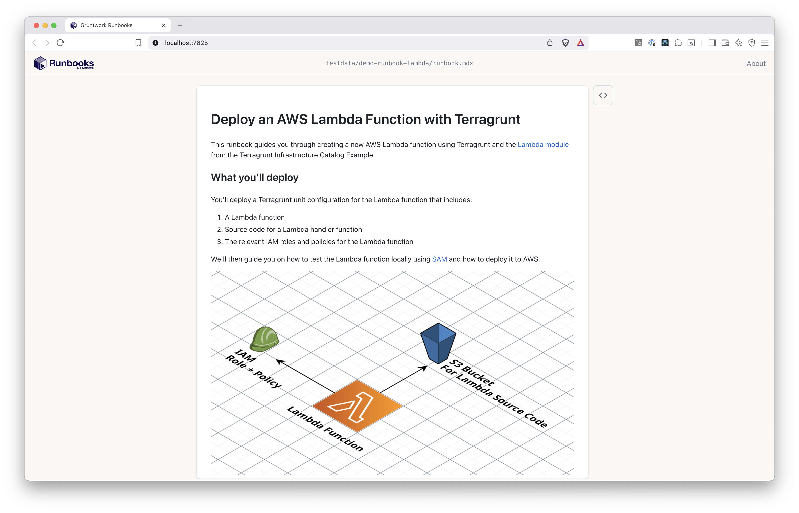
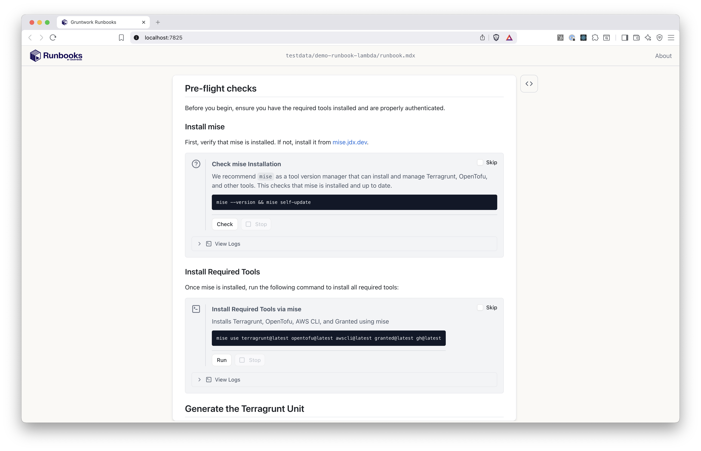
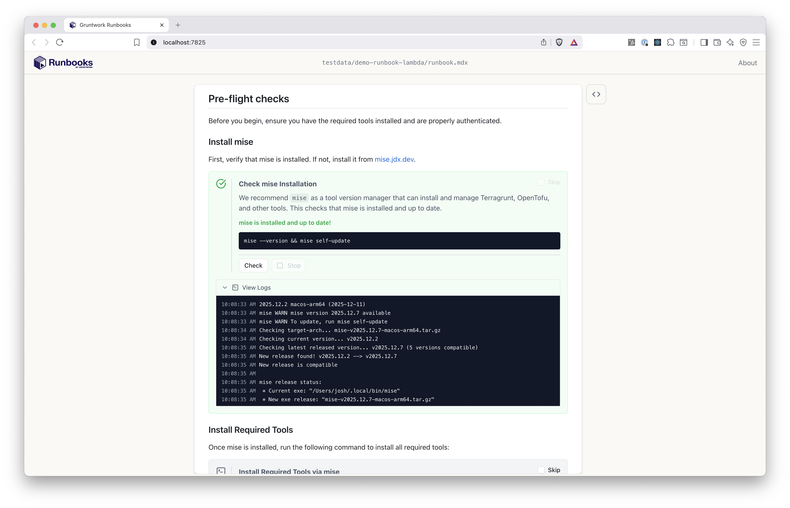
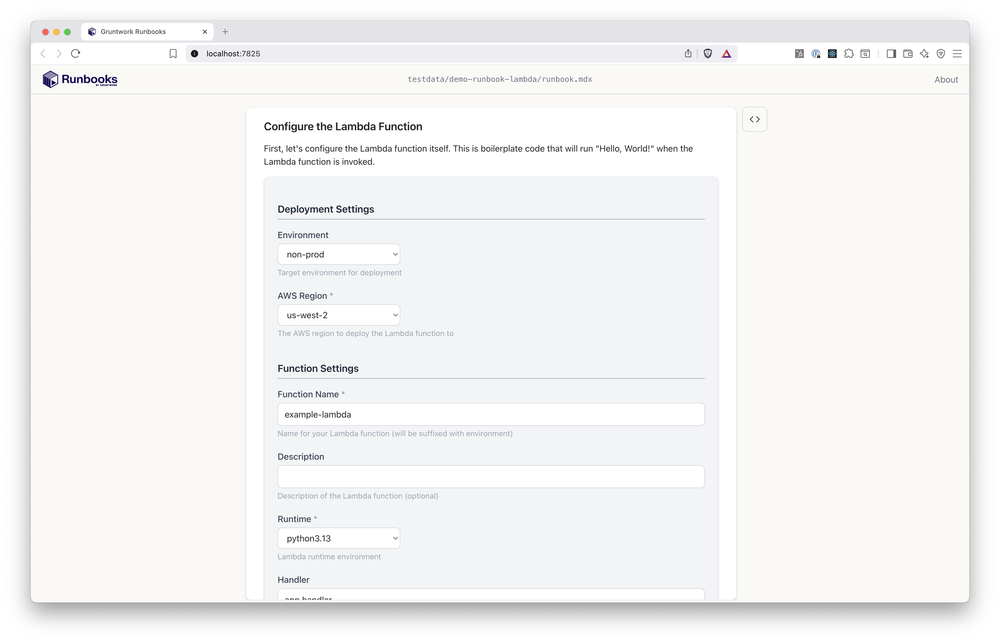
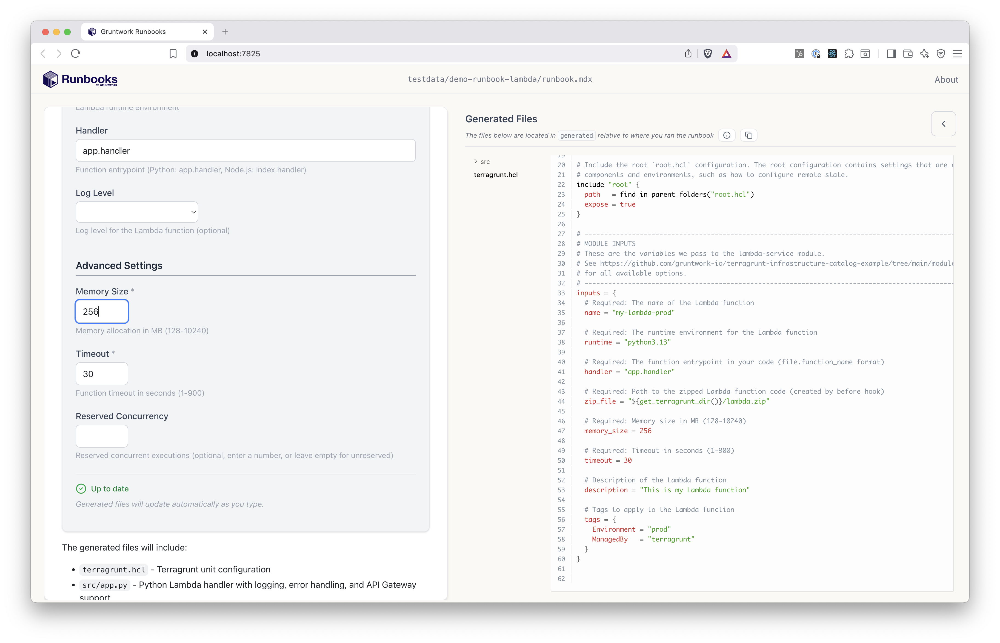
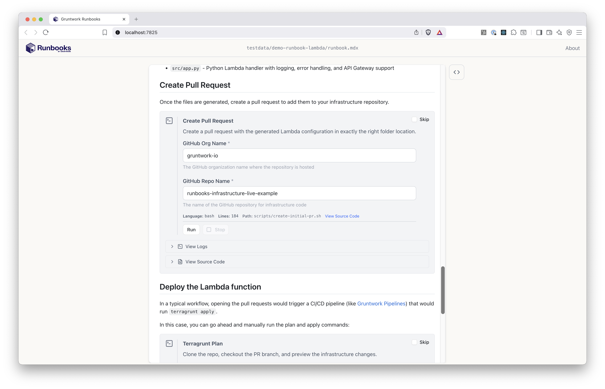
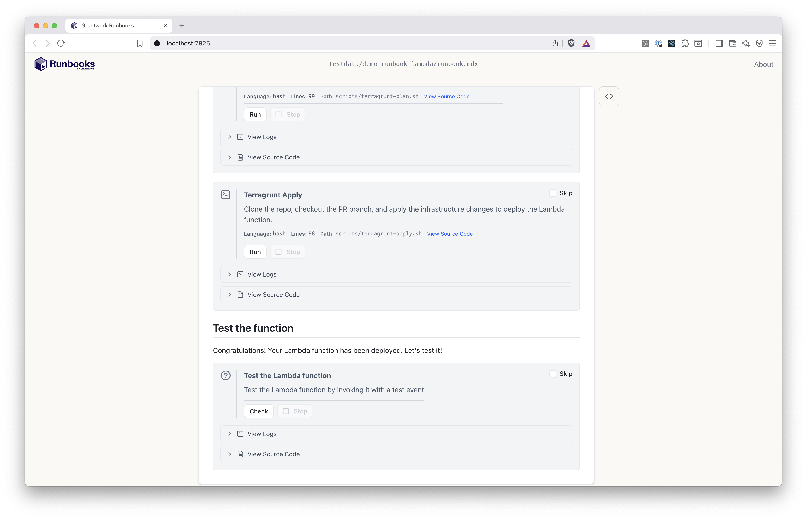

On this page, we'll walk through the **Runbooks consumer** experience when a user opens the [demo-runbook-lambda runbook](https://github.com/gruntwork-io/runbooks/tree/main/testdata/demo-runbook-lambda). Our user's goal is to launch an AWS Lambda function on AWS in a way that matches their organization's standards.

First, the user installs Runbooks and downloads the `demo-runbook-lambda` to their local file system.

Now, they open the runbook.

```bash
runbooks open /path/to/demo-runbook-lambda
```

Runbooks launches a web browser to access `localhost:7825` and renders the runbook.



It looks like this runbook will help us launch an AWS Lambda function.

So far, the runbook is just rendering markdown text. Useful, but not very interesting. Let's see what else this runbook contains.



Here, the user has is given some "pre-flight checks" to make sure their local system has the right tools installed (in this case `mise`, a package manager). The user can click "Check" and Runbooks will run the given command (in this case `mise --version && mise self-update`) directly on their local machine.



The Runbooks consumer can just use the web UI without knowing anything about how the Runbook is written. For the Runbook author, that first gray box is is a [Check block](/authoring/blocks/check/) and is defined like this:

```mdx
<Check
  id="check-mise"
  command="mise --version && mise self-update"
  title="Check mise Installation"
  description="We recommend `mise` as a tool version manager that can install and manage Terragrunt, OpenTofu, and other tools. This checks that mise is installed and up to date."
  successMessage="mise is installed and up to date!"
  failMessage="mise is not installed. Install it from https://mise.jdx.dev/getting-started.html"
/>
```

The key point here is that authors declare what they want to happen, and Runbooks dynamically renders it as an interactive web UI.

Let's scroll a little further down so we can actually generate some of the code we need to launch our Lambda function.



Here the Runbook is dynamically rendering a web form to capture user values by using a [Template block](/authoring/blocks/template/). To collect these specific values from the user, the Runbooks author declared a set of variables in their runbook like this:

```yaml
variables: 
  - name: Environment
    type: enum
    description: Target environment for deployment
    options:
      - non-prod
      - prod
    default: non-prod
    x-section: Deployment Settings
  
  - name: AwsRegion
    type: enum
    options:
      - us-east-1
      - us-east-2
      - us-west-1
      - us-west-2
      - eu-central-1
      - eu-west-1
      - eu-west-2
    description: The AWS region to deploy the Lambda function to
    default: "us-west-2"
    validations: "required"
    x-section: Deployment Settings

  - name: FunctionName
    type: string
    description: Name for your Lambda function (will be suffixed with environment)
    default: example-lambda
    validations: "required"
    x-section: Function Settings

  - name: Description
    type: string
    description: Description of the Lambda function (optional)
    x-section: Function Settings

  ...
```

Back to the user, they click a "Generate" button at the bottom of the form (not shown), and Runbooks will generate a set of files based on a code template defined by the Runbook author, all parameterized by the values entered by the user.



As the user changes values in the form, the rendered files will update in real time. This lets the user see exactly how their form values impact the code that's generated.

The generated files are written directly to the user's local computer. That means we can easily create a GitHub Pull Request (or similar) with these files. In this case, the Runbook author included a script to do that just that.



Here, the Runbook author is using a [Command block](/authoring/blocks/command/) to create the Pull Request, and notice how the author configured the Command block to ask for additional values (GitHub org name, GitHub repo name). Those values will be used to customize the script that runs.

Finally, the user gets a Check block to validate that the Lambda function deployed successfully.

.

And now you've seen the Runbook experience! 

## See a video walkthrough

You can also view the above as a full video walkthrough.

<div style="position: relative; padding-bottom: 56.25%; height: 0;"><iframe src="https://www.loom.com/embed/0848381b1e174670895e3228a69b865a" frameborder="0" webkitallowfullscreen mozallowfullscreen allowfullscreen style="position: absolute; top: 0; left: 0; width: 100%; height: 100%;"></iframe></div>

## Next

Now that you understand how Runbooks work, it's time to install the CLI tool on your local machine!
