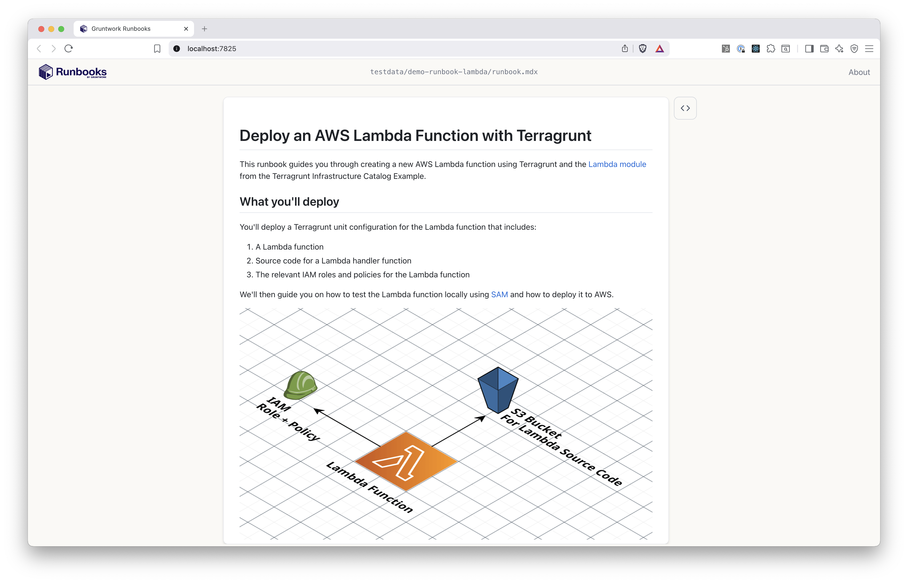
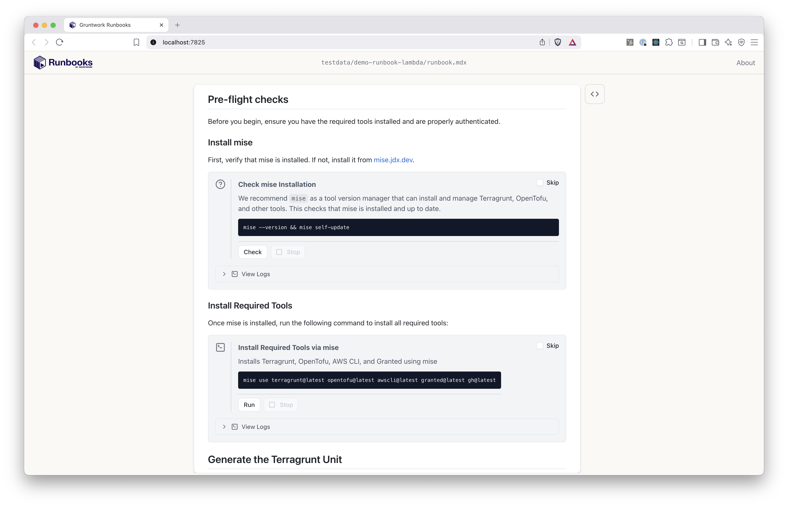
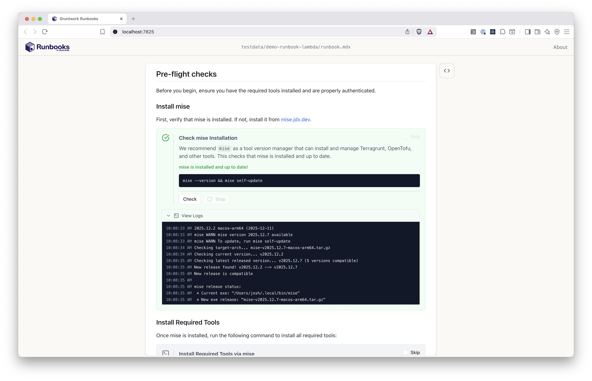
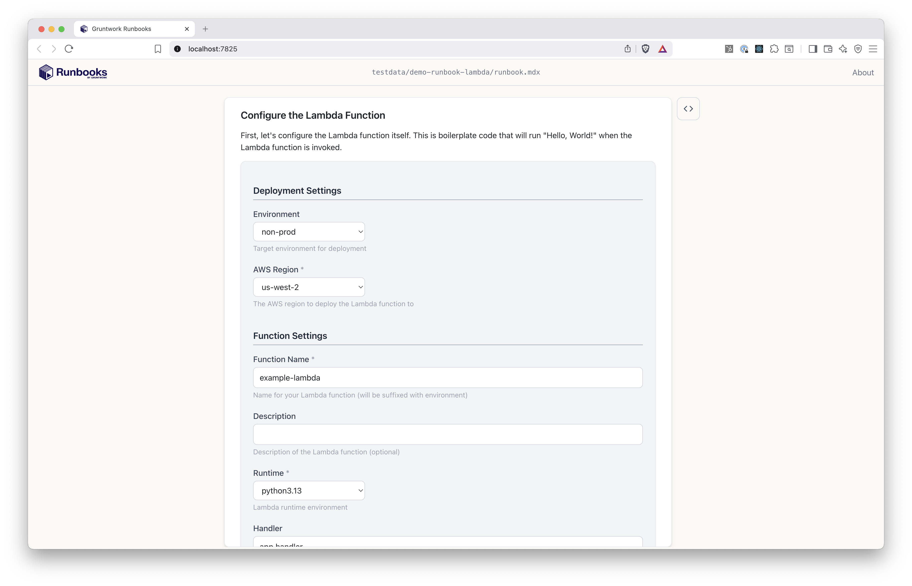
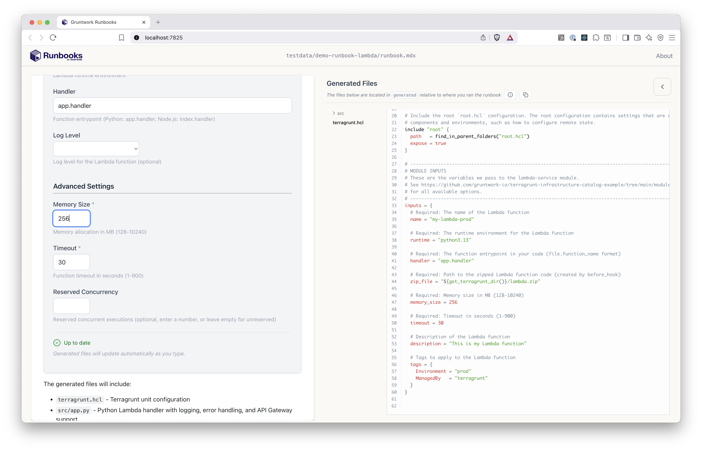
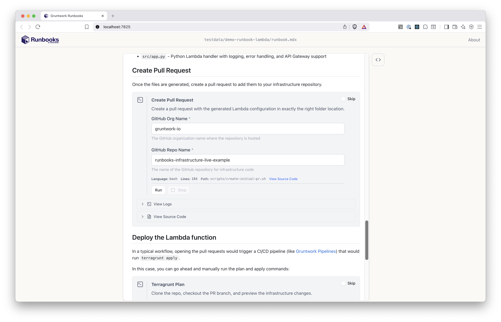
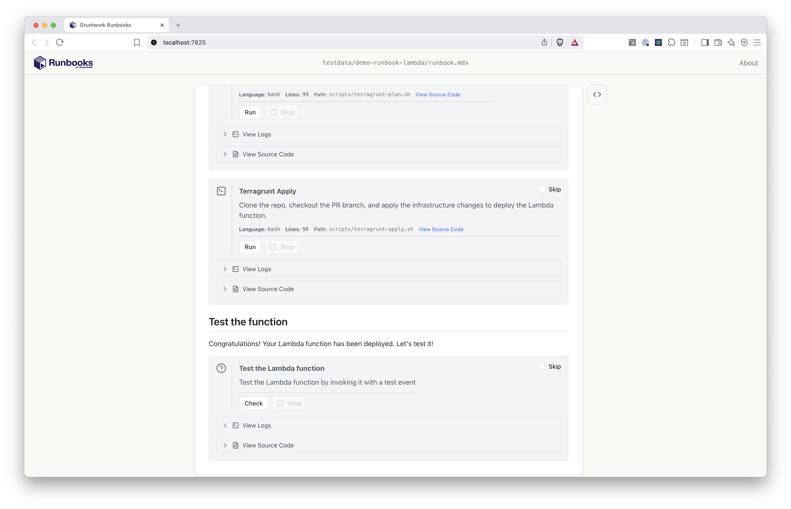

This page follows a runbook consumer who opens the [lambda sample runbook](https://github.com/gruntwork-io/runbooks/tree/main/testdata/sample-runbooks/lambda). Their goal is to launch an AWS Lambda function in a way that matches their organization's standards.

There is a [written walkthrough](#written-walkthrough) and a [video walkthrough](#video-walkthrough).

## Written walkthrough

The user installs Runbooks, downloads the `lambda` sample runbook, and opens it:

```bash
runbooks open /path/to/lambda
```

The Runbooks window opens and renders the runbook.



So far the runbook is rendering markdown text.

:::tip[Find in page]
Runbooks can get long. Press **Cmd+F** on macOS, or **Ctrl+F** on Windows and Linux, to search the runbook and any logs or outputs you have expanded. Press **Enter** / **Shift+Enter** (or **Cmd/Ctrl+G** / **Shift+Cmd/Ctrl+G**) to move between matches, and **Esc** to close the find bar. Collapsed sections, such as logs you haven't opened, aren't searched, and neither is the text in form fields.
:::

:::tip[Command palette]
Press **Cmd+K** on macOS, or **Ctrl+K** on Windows and Linux, to open the command palette, then type to filter. It holds everything in the **Menu** and the application menus: open or close a runbook, show the generated files, download logs, switch the theme or [instruction mode](/intro/instruction-mode/), and open the docs. **Jump to section** lists the runbook's headings, so you can move to any part of a long runbook without scrolling. Press **Backspace** in an empty search to go back to the commands, and **Esc** to close.
:::



Next come pre-flight checks that confirm the user's machine has the right tools installed, in this case the `mise` tool version manager. When the user clicks "Check", Runbooks runs the command `mise --version && mise self-update --yes` on their machine.



The consumer uses the UI without knowing how the runbook is written. To the author, that first gray box is a [Check block](/authoring/blocks/check/), defined like this:

```mdx
<Check
  id="check-mise"
  command="mise --version && mise self-update --yes;"
  title="Check mise Installation"
  description="We recommend `mise` as a tool version manager that can install and manage Terragrunt, OpenTofu, and other tools. This checks that mise is installed and up to date."
  successMessage="mise is installed and up to date!"
  failMessage="mise is not installed. Install it from https://mise.jdx.dev/getting-started.html"
/>
```

Authors declare what they want to happen, and Runbooks renders it as an interactive UI.

Further down, the runbook generates the code needed to launch the Lambda function.



This form comes from a [Template block](/authoring/blocks/template/). To collect these values from the user, the author declared a set of variables like this:

```yaml
variables: 
  - name: Environment
    type: enum
    description: Target environment for deployment
    options:
      - non-prod
      - prod
    default: non-prod
    x-section: Deployment Settings
  
  - name: AwsRegion
    type: enum
    options:
      - us-east-1
      - us-east-2
      - us-west-1
      - us-west-2
      - eu-central-1
      - eu-west-1
      - eu-west-2
    description: The AWS region to deploy the Lambda function to
    default: "us-west-2"
    validations:
      - required
    x-section: Deployment Settings

  - name: FunctionName
    type: string
    description: Name for your Lambda function (will be suffixed with environment)
    default: example-lambda
    validations:
      - required
    x-section: Function Settings

  - name: Description
    type: string
    description: Description of the Lambda function (optional)
    x-section: Function Settings

  ...
```

The user clicks the "Generate" button at the bottom of the form, which the screenshot does not show. Runbooks generates a set of files from the author's code template, using the values the user entered.



As the user changes values in the form, the rendered files update, so the user sees how each value changes the generated code.

Runbooks writes the generated files to the user's machine, so a script can open a GitHub pull request with them. This runbook's author included one.



The author used a [Command block](/authoring/blocks/command/) to create the pull request, and configured it to ask for a GitHub org name and repo name. The script that runs uses those values.

The last block is a Check that validates the Lambda function deployed.



## Video walkthrough

<div style="position: relative; padding-bottom: 56.25%; height: 0;"><iframe src="https://www.loom.com/embed/0848381b1e174670895e3228a69b865a" frameborder="0" webkitallowfullscreen mozallowfullscreen allowfullscreen style="position: absolute; top: 0; left: 0; width: 100%; height: 100%;"></iframe></div>

## Next

Next, [install Runbooks](/intro/installation/).
