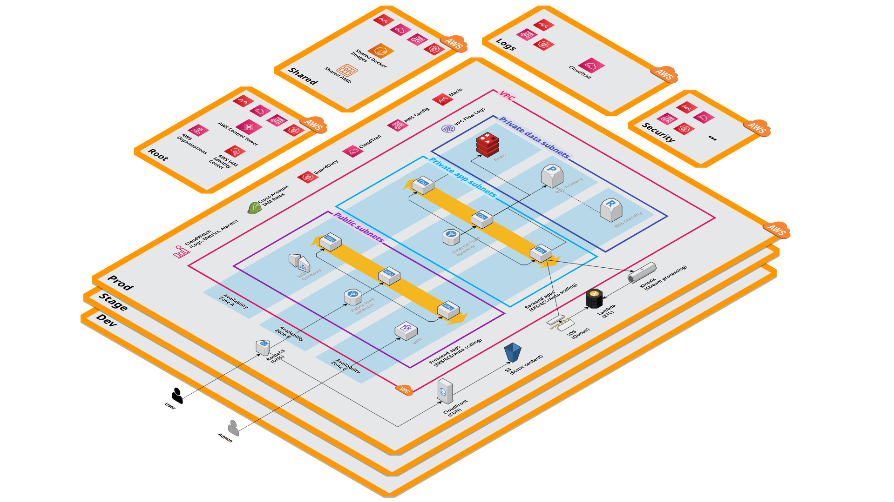

# Welcome to the Gruntwork AWS Accelerator!

Congratulations on your new Gruntwork purchase. To bootstrap your new best-practice AWS multi-account setup, we'll use a collection of **Runbooks** (this one being the first) to both bootstrap your infrastructure and teach you what's happening at every step of the way.

### What you'll get

As part of this process, we'll be creating foundational patterns in two key areas:

1. **Infrastructure as code:** Terragrunt, OpenTofu, Terraform, etc.
2. **AWS:** AWS Organization, AWS Accounts, IAM Roles, VPCs, etc.

### AWS architecture

Here's a preview of the AWS infrastructure we'll be creating:



### IaC architecture

You'll see the IaC architecture shortly in the next Runbook.

## Three foundational git repos

The very first thing we'll do is create three foundational git repos to store your infrastructure as code:

1. `infrastructure-live-root`
2. `infrastructure-live-access-control`
3. `infrastructure-catalog`

### Repos have both code and "access"

Each of the git repos above will contain **code** that describes the desired state of your infrastructure. But we somehow need to "apply" that code, so we're also going to grant GitHub Actions workflows that run in your repos varying levels of **AWS access** in the form of AWS IAM permissions.

Let's review what each of these repos is:

### infrastructure-live-root

- **Purpose:** Manage your AWS organization, manage "central" AWS accounts, create new AWS accounts.
- **Access:** This repo will have broad access to your entire cloud footprint, including AWS and other clouds.
- **Users:** This repo is typically restricted to a small group of trusted users.

### infrastructure-live-access-control

- **Purpose:** Manage the cloud permissions that each individual app team has in their dedicated team repos.
- **Access:** This repo will have access to the "shared" AWS accounts, such as the logs account, the security account, and the shared account.
- **Users:** This repo is typically restricted to a small group of trusted users.

### infrastructure-catalog

- **Purpose:** Store your organization's officially approved infrastructure patterns, including OpenTofu/Terraform modules, Terragrunt units, Terragrunt stacks, Runbooks (like this one!), Boilerplate templates, and policies-as-code. When your app teams launch infrastructure, they should be pulling resources from this catalog repo.
- **Access:** This repo will have access to the "shared" AWS accounts, such as the logs account, the security account, and the shared account.
- **Users:** This repo is typically restricted to a small group of trusted users.

## Individual team repos

Each of your app teams will have their own dedicated git repo to store the infrastructure as code specific to their team. You can use the foundational repos to enable these individual team repos as follows:

- You can create the AWS accounts corresponding to each team using the `infrastructure-live-root` repo.
- You can grant the team the appropriate AWS permissions using the `infrastructure-live-access-control` repo.
- The team will launch infrastructure using primarily instances of the patterns defined in the `infrastructure-catalog` repo.

## Next steps

Now that you understand the repos and how they work together, let's move on to the next runbook where we'll start creating the actual infrastructure.

Open the next Runbook: 

```bash
runbooks open testdata/demo-runbook-2/runbook.mdx
```