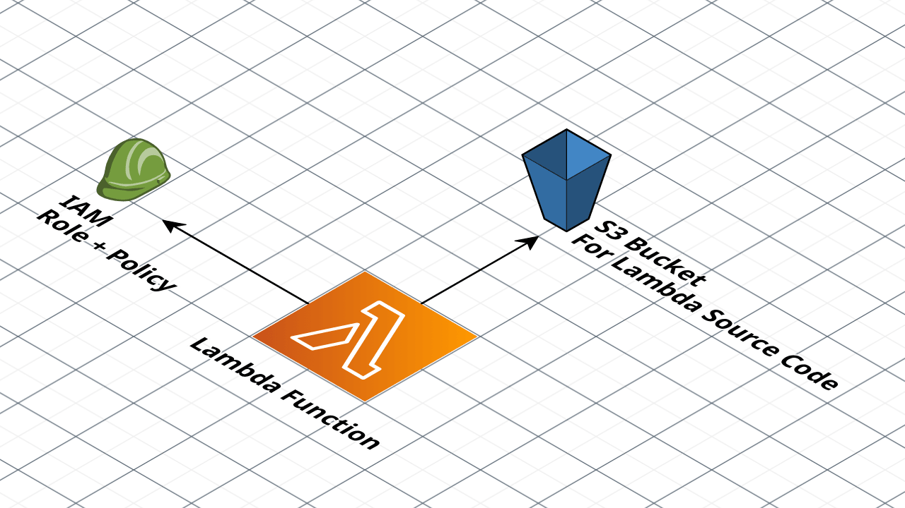

# Deploy an AWS Lambda Function with Terragrunt

This runbook guides you through creating a new AWS Lambda function using Terragrunt and the [Lambda module](https://github.com/gruntwork-io/terragrunt-infrastructure-catalog-example/tree/main/modules/lambda-service) from the Terragrunt Infrastructure Catalog Example.

## What you'll deploy

You'll deploy a Terragrunt unit configuration for the Lambda function that includes:

1. A Lambda function
2. Source code for a Lambda handler function
3. The relevant IAM roles and policies for the Lambda function

We'll then guide you on how to test the Lambda function locally using [SAM](https://aws.amazon.com/serverless/sam/) and how to deploy it to AWS.



## Pre-flight checks

Before you begin, ensure you have the required tools installed and are properly authenticated.

### Install mise

First, verify that mise is installed. If not, install it from [mise.jdx.dev](https://mise.jdx.dev/getting-started.html).

<Check
  id="check-mise"
  command="mise --version && mise self-update"
  title="Check mise Installation"
  description="We recommend `mise` as a tool version manager that can install and manage Terragrunt, OpenTofu, and other tools. This checks that mise is installed and up to date."
  successMessage="mise is installed and up to date!"
  failMessage="mise is not installed. Install it from https://mise.jdx.dev/getting-started.html"
/>

### Install Required Tools

Once mise is installed, run the following command to install all required tools:

<Command
  id="install-tools"
  command="mise use terragrunt@latest opentofu@latest awscli@latest granted@latest gh@latest"
  title="Install Required Tools via mise"
  description="Installs Terragrunt, OpenTofu, AWS CLI, and Granted using mise"
  successMessage="All tools installed successfully!"
  failMessage="Failed to install tools. Check the logs for details."
/>

## Generate the Terragrunt Unit

Now it's time to generate the code for a **Terragrunt unit** that deploys the Lambda function.

### What's a Terragrunt Unit?

The pattern we will use for defining a Lambda function is already authored in this [OpenTofu/Terraform Lambda module](https://github.com/gruntwork-io/terragrunt-infrastructure-catalog-example/tree/main/modules/lambda-service).

To launch an _instance_ of that module with its own unique configuration values and Lambda function, we will create a Terragrunt unit, which is a file read by [Terragrunt](https://terragrunt.gruntwork.io/) that will download the OpenTofu/Terraform module, pass in the values from the Terragrunt unit, and deploy it using OpenTofu/Terraform.

### Configure the Lambda Function

First, let's configure the Lambda function itself. This is boilerplate code that will run "Hello, World!" when the Lambda function is invoked.

<BoilerplateInputs
  id="lambda-config"
  templatePath="templates/lambda-unit"
/>

The generated files will include:
- `terragrunt.hcl` - Terragrunt unit configuration
- `src/app.py` - Python Lambda handler with logging, error handling, and API Gateway support

## Create Pull Request

Once the files are generated, create a pull request to add them to your infrastructure repository.

<Command
  id="create-pr"
  path="scripts/create-initial-pr.sh"
  title="Create Pull Request"
  description="Create a pull request with the generated Lambda configuration in exactly the right folder location."
  successMessage="Pull request created successfully!"
  failMessage="Failed to create pull request. See logs for details on what went wrong."
  boilerplateInputsId="lambda-config"
>
   <BoilerplateInputs id="repo-config">
   ```yaml
    variables:
      - name: GithubOrgName
        type: string
        description: The GitHub organization name where the repository is hosted
        default: "gruntwork-io"
        validations: "required"
      - name: GithubRepoName
        type: string
        description: The name of the GitHub repository for infrastructure code
        default: "runbooks-infrastructure-live-example"
        validations: "required"
    ```
    </BoilerplateInputs>
</Command>

## Deploy the Lambda function

In a typical workflow, opening the pull requests would trigger a CI/CD pipeline (like [Gruntwork Pipelines](https://www.gruntwork.io/platform/pipelines)) that would run `terragrunt apply`. 

In this case, you can go ahead and manually run the plan and apply commands:

<Command
  id="terragrunt-plan"
  path="scripts/terragrunt-plan.sh"
  title="Terragrunt Plan"
  description="Clone the repo, checkout the PR branch, and preview the infrastructure changes."
  successMessage="Plan completed successfully! Review the changes above."
  failMessage="Terragrunt plan failed. See logs for details."
  boilerplateInputsId={["lambda-config", "repo-config"]}
/>

<Command
  id="terragrunt-apply"
  path="scripts/terragrunt-apply.sh"
  title="Terragrunt Apply"
  description="Clone the repo, checkout the PR branch, and apply the infrastructure changes to deploy the Lambda function."
  successMessage="Lambda function deployed successfully!"
  failMessage="Terragrunt apply failed. See logs for details."
  boilerplateInputsId={["lambda-config", "repo-config"]}
/>

## Test the function

Congratulations! Your Lambda function has been deployed. Let's test it!

<Check
  id="test-function"
  path="checks/test-lambda.sh"
  title="Test the Lambda function"
  description="Test the Lambda function by invoking it with a test event"
  successMessage="Lambda function invoked successfully!"
  failMessage="Failed to invoke Lambda function. See logs for details on what went wrong."
  boilerplateInputsId="lambda-config"
/>


